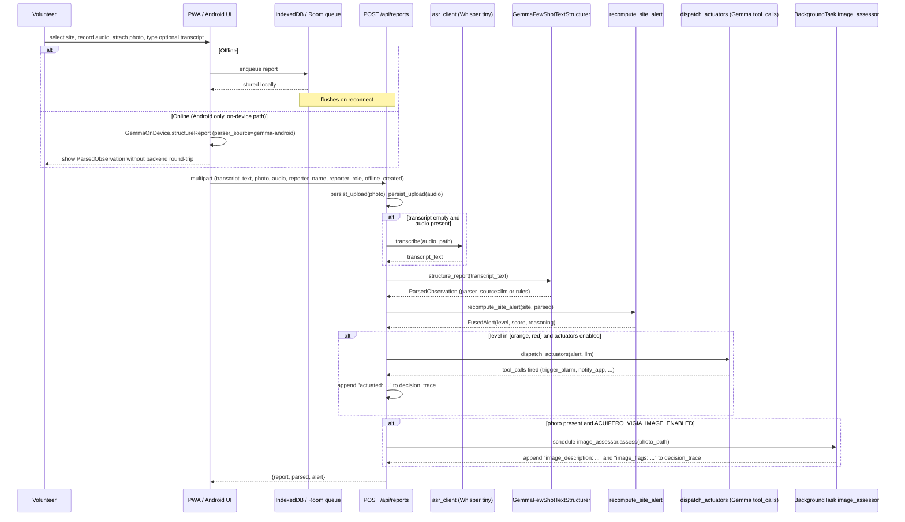

# Vigía — Volunteer-Report Flow

## 1. Overview

Vigía is the volunteer-facing half of the Acuífero 4 + Vigía submission. Its user is a Defensa Civil municipal volunteer in Argentina's Litoral region, today coordinating flood and storm reports over WhatsApp audio messages that pile up in a single chat and are triaged by hand. Vigía replaces that pipeline with a structured intake: a PWA (or Android app) captures audio, photo, and an optional typed transcript, ships it to a backend that parses it into a `ParsedObservation`, fuses it with the site's camera-derived signals into a `FusedAlert`, and — when the alert is orange or red — lets Gemma 4 emit tool calls that drive local actuators (alarm, radio, push notification). Unlike a WhatsApp thread, every report is timestamped, geo-tagged to a site, machine-parseable, and queueable while offline.

## 2. End-to-end data flow



Routing entry point: `backend/src/acuifero_vigia/api/routers/vigia.py`.

## 3. The `parser_source` field

| Value | Where it's set | What it means |
|---|---|---|
| `"rules"` | `services/report_structuring._fallback_parse` | Deterministic keyword parser. Used when the LLM is unreachable or returns unparseable JSON. Always available. |
| `"llm"` | `services/report_structuring._normalize_llm_payload` | Gemma 4 via Ollama on the backend host (`GemmaFewShotTextStructurer` with the rioplatense few-shot corpus). Default when Ollama is reachable. |
| `"gemma-android"` | `ui/MainViewModel.submitReport` (Android) | Gemma 4 running on-device via MediaPipe LLM Inference. Set when the `.task` asset is present and `structureReport` returned valid JSON. No silent fallback to the backend on failure — the operator sees the error and can retry. |

The Android UI surfaces this field as a small chip next to the parsed observation, with Spanish labels chosen so a volunteer in the field can reason about provenance without reading logs:

- `"Analizado con Gemma en este dispositivo"` for `gemma-android`
- `"Analizado por Gemma en el servidor"` for `llm`
- `"Estructurado por reglas locales"` for `rules`

The chip is informational; it does not gate submission or escalation.

## 4. New environment variables introduced on this branch

| Name | Default | Purpose |
|---|---|---|
| `ACUIFERO_FEWSHOT_COUNT` | `12` | Number of rioplatense few-shot examples injected into the structuring prompt. Drop to `4` for CPU-only dev to keep prompt processing under ~90 s. |
| `ACUIFERO_ASR_ENABLED` | `true` | Master switch for the Whisper transcription path. Set to `false` to skip ASR entirely (typed transcripts only). |
| `ACUIFERO_ASR_MODEL_SIZE` | `"tiny"` | Faster-Whisper model size. `tiny` is int8-quantized, ~75 MB cache, ~3× realtime on CPU. |
| `ACUIFERO_ASR_MODEL_CACHE_DIR` | `backend/data/whisper-models` | Local cache directory for the downloaded Whisper weights. |
| `ACUIFERO_VIGIA_IMAGE_ENABLED` | inherits `ACUIFERO_MULTIMODAL_ENABLED` | Separate flag so volunteer-photo assessment can be enabled while node-side multimodal stays off (or vice versa). |
| `ACUIFERO_ACTUATORS_ENABLED` | `true` | When `false`, `dispatch_actuators` is short-circuited and no tool calls are issued regardless of alert level. |

## 5. Latency on CPU-only dev hardware (Ryzen 7, no GPU)

Measured during this branch's Phase 0:

- Gemma 4 E2B: ~3.5 tokens/s sustained.
- ASR (Whisper tiny int8): first-call cold load ~35 s; transcription of a 30 s wav: ~5–10 s.
- Image assessment on a single frame (multimodal Gemma): ~190 s wall-clock (192 s for the USGS demo frame). This is the reason image assessment is wired as a FastAPI `BackgroundTask` and not synchronous inside the POST handler — a synchronous call would push the response well past any reasonable mobile HTTP timeout.
- Full `POST /api/reports` without image, with 4 few-shot examples: ~3 minutes.

Demo machines with GPU acceleration (the production target via MediaPipe on Android, or a Raspberry Pi paired with a hardware accelerator) bring these numbers into seconds. The CPU-only figures above are the floor, not the target.

## 6. Known gaps and out-of-scope items

- Native photo and audio capture inside the Android UI is NOT implemented in this PR. The device-capture path requires CameraX plus `MediaRecorder` wiring and was deferred because no physical device or emulator was available in this session. The PWA covers the demo path; Android currently exercises the on-device structuring layer against typed transcripts.
- The `.task` asset (gemma4-e2b for MediaPipe, ~1.4 GB) is NOT bundled in the APK and is NOT auto-downloaded. The `GemmaOnDevice` wrapper expects it at `context.filesDir/gemma4-e2b.task`; the dev or operator places it there manually for now.
- Android unit tests under `app/src/test/` are written but were NOT executed in this session because the dev machine lacks the Android SDK. Run `./gradlew :app:testDebugUnitTest` once the SDK is installed.
- Real-device benchmarks for on-device Gemma latency are pending. The numbers in `docs/hackathon/android_gemma.md` are still projections.
- iOS Safari `MediaRecorder` has well-known quirks; the PWA targets Chrome-class browsers for the hackathon demo. This belongs in the pitch script.
- Tool-call dispatch is gated on Ollama Gemma 4 emitting valid `tool_calls`, verified in Phase 0 V1 of this branch. If a different model is wired in, the behaviour falls back to an empty actuator list — no actuators fired, no error raised.
- `frontend/src/pages/Calibration.tsx` has a pre-existing lint error (`react-hooks/immutability`: `draw` referenced before declaration). This bug is from commit `ce62b88` (P5 calibration UI, pre-Vigía branch). It is not introduced by this PR and is left for a separate fix so the diff stays focused on Vigía.

## 7. How to reproduce the demo flow

1. From the repo root: `./scripts/dev.sh` (starts Ollama, backend, and the PWA frontend; this is the existing entry point — no new launcher).
2. With Ollama warm, smoke-test the endpoint directly:

   ```bash
   curl -X POST http://127.0.0.1:8000/api/reports \
     -F "transcript_text=Hay agua sobre la calle y sigue subiendo" \
     -F "reporter_name=Demo" \
     -F "reporter_role=volunteer" \
     -F "offline_created=false" \
     -F "photo=@fixtures/frames/silverado_060s.jpg" \
     -F "audio=@/path/to/any_30s.wav"
   ```

   Any 30 s wav works for `audio`; the photo path above is the USGS demo frame already in the repo.
3. Open `http://127.0.0.1:5173`, navigate to Report, record voice, attach a photo, and submit through the PWA.
4. Observe: backend log shows `local alarm triggered ...`, the response carries alert level red, and `decision_trace` contains both `actuated: trigger_alarm, notify_app` (or similar, depending on what Gemma chose) AND eventually `image_description: ...` once the background task finishes.

## 8. References

- `docs/architecture.md` — shared backend architecture across Acuífero and Vigía.
- `docs/hackathon/recon.md` — how the Vigía gap surfaced during P0 recon.
- `docs/hackathon/rioplatense_eval.md` — the few-shot corpus and structuring benchmark.
- `docs/hackathon/android_gemma.md` — the on-device path (this PR wires it; that doc still carries projected, not measured, latencies).
- `MAIN_IDEA.md` — product brief.
